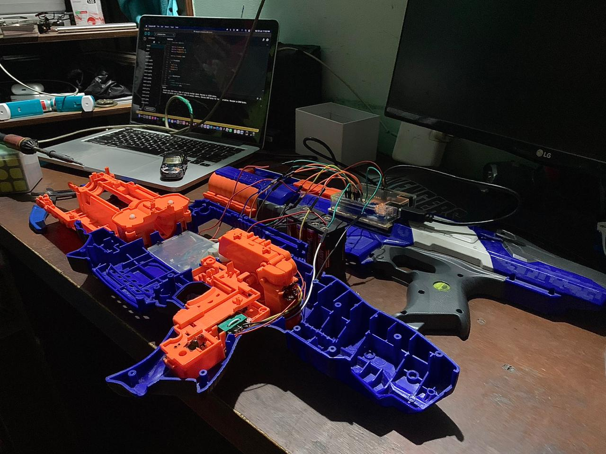
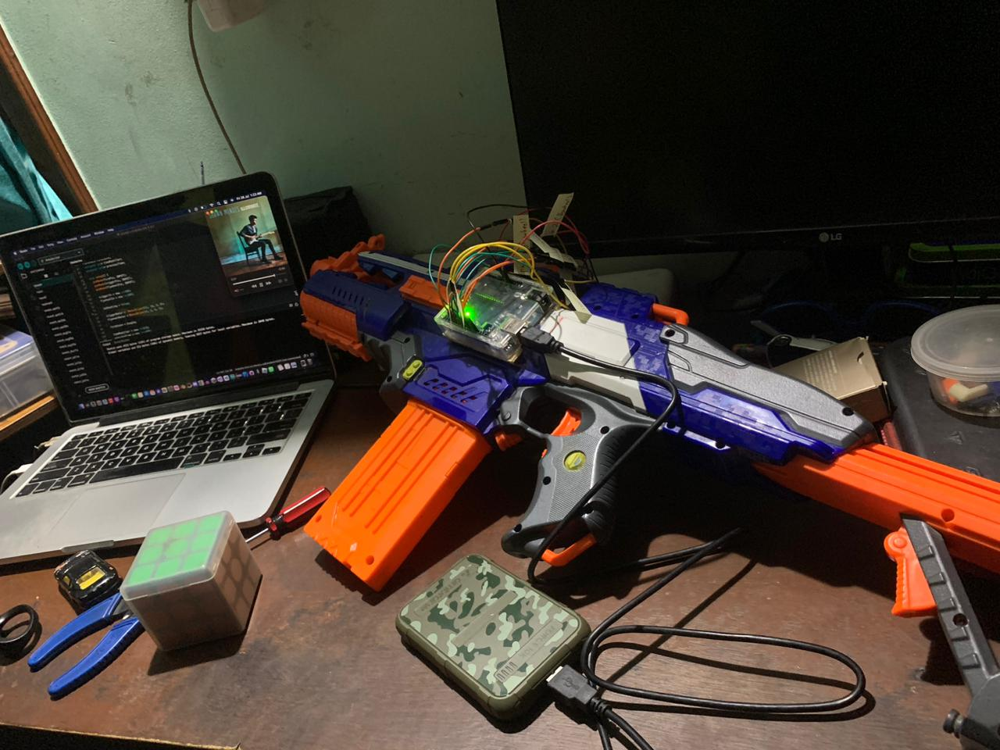

# ard.blaster
I put an Arduino on a Nerf Gun. It was fun. Thanks to <a href="https://github.com/nt314p" target="_blank">nt314p</a> for helping me through my code

### Internals

  

### Final Assembly:

  

